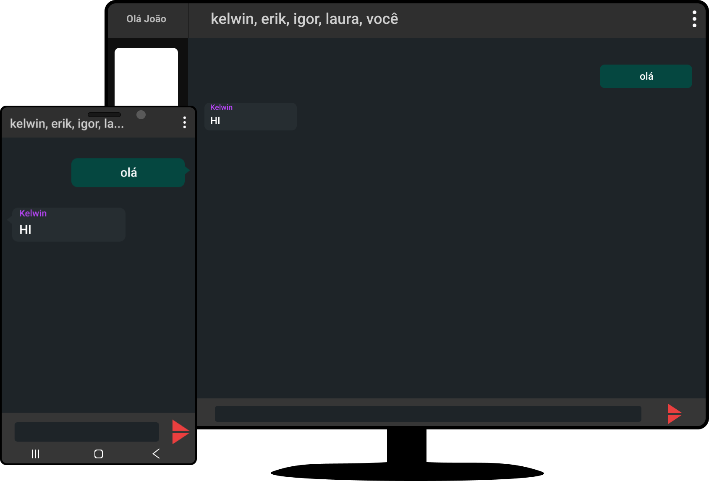
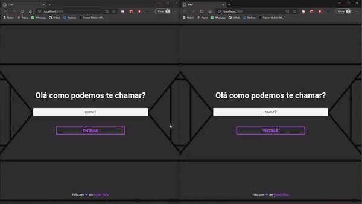

<h1 align="center">
  
</h1>

<h3 align="center">Um chat criado com socket.io</h3>
<p align="center"> para fins educativos</p>
<p align="center">
  Feito por 
  <a href="https://rocketseat.com.br/"> Kelwin vieira💜</a>
</p>

<p align="center">
  
</p>

<p align="center">
  <kbd>
    
  </kbd>
</p>

<br/>
<br/>

---

<h1 align="center"> Status do Projeto </h1>

- [x] Servidor
- [x] Web versão
- [ ] Versão mobile em andamento...🔨

---

<br/>
<br/>

# Pré-requisitos

para rodar o projeto em sua maquina, você precisará ter o [Node.js](https://nodejs.org/en/) instalado na sua máquina e o [Git](https://git-scm.com) para clonar esse repositorio.

Além disto, é de preferencia um bom editor código, minha recomendação é o [VSCode](https://code.visualstudio.com/)

E para o mibile usaremos o App do [Expo](https://expo.io/) que você pode buscar tanto na [Google Play](https://play.google.com/store/apps/details?id=host.exp.exponent&hl=pt_BR) quanto
na [App Store](https://apps.apple.com/br/app/expo-client/id982107779) buscando por expo ou clicando nos links relativo ao seu parelho

<br/>
<br/>

## Iniciando

### Dentro de uma pasta de sua escolha, em seu terminal, execulte os seguintes comandos:

```bash
# Clone este repositório
$ git clone https://github.com/kelwinv/chat-com-socket.io
# Acesse a pasta do projeto no terminal/cmd
$ cd chat-com-socket.io
```

### Com isso vc já terá um clone da aplicação e estará dentro dela

<br/>
<br/>

## Inciando back-end

### Agora iremos executar nosso servido com os seguintes passos

```bash
# Dentro da pastar nlw3, Vá para a pasta server
$ cd server
# E para instarlar as dependecias de:
$ npm install

# Apos isso ja podera abri o servido em http://localhost:3333 com:
$ npm run dev
```

<br/>
<br/>

## Inciando web/mobile

### tanto o web quanto o app tem a mesma forma de instalar as depedencias e inciar o projeto
### em suas pastas correspondetes basta executar

```bash
$ npm install
# e após isso
$ npm run start
```

### e com isso as abas do navegador irão abrir automaticamente.
### no servidor mobile ira aperecer um QRCode use a camera do Expo para poder entrar ou abra a url em seu emulador

<br />
<br />

# 🛠 Tecnologias

As seguintes ferramentas foram usadas na construção do projeto:

- [Expo](https://expo.io/)
- [Node.js](https://nodejs.org/en/)
- [React](https://pt-br.reactjs.org/)
- [React Native](https://reactnative.dev/)
- [TypeScript](https://www.typescriptlang.org/)
- [express](https://expressjs.com/pt-br/)
- [socket.io](https://socket.io/)
- [styled-components](https://styled-components.com/)
- [ts-node-dev](https://www.npmjs.com/package/ts-node-dev)